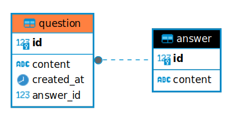
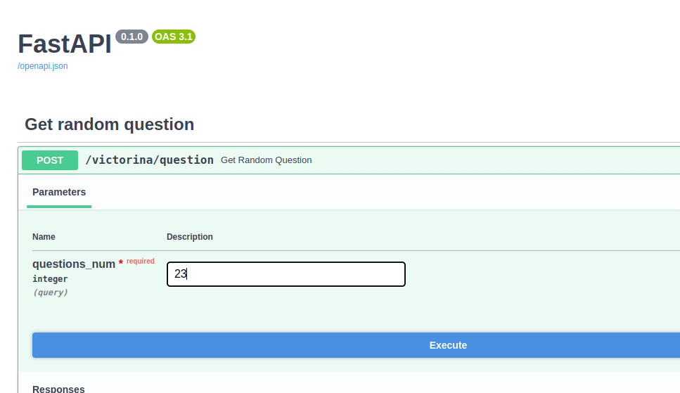

# Вопросы для викторины
Веб сервис **random_questions** предназначен для генерации англоязычных уникальных вопросов при получении POST-запроса.

В параметры POST-запроса передается количество вопросов для генераци:
`{"questions_num": integer}`

После получения запроса веб-сервис запрашивает с публичного API англоязычные вопросы для викторины, обращаясь по адресу https://jservice.io/api/random?count=<questions_num>
При этом, в параметре запроса `count` указывается количество генерирующих вопросов `questions_num`


Полученные вопросы и ответы сохраняются в базе данных PostgreSQL. \
Структура базы данных, с которой работает веб сервис **random_questions**, представлена ниже:



Ответом на POST-запрос со стороны веб-сервиса является предыдущий сохраненный вопрос, который хранится в базе данных:
```
    {"question": "What is the capital of Russia?"}
```

## Переменные окружения
Перед запуском веб-сервиса на host-системе убедитесь в наличии в
директории с проектом файла ".env", хранящего следующие настройки:

* **DB_HOST** = localhost
  > IP адрес, где расположена база данных
* **DB_PORT** = 5432
  > номер порта, по которому необходимо обращаться для подключения к БД
* **DB_USER** = ...
  > имя пользователя в PostgreSQL
* **DB_PASS** = ...
  > пароль для пользователя в PostgreSQL
* **DB_NAME** = victorina
  >  имя БД
* **URL** = https://jservice.io/api/random
  > адрес для генерации вопросов


## Запуск приложения
Для запуска FastAPI используется веб-сервер `uvicorn`. Веб-сервер `uvicorn` необходимо запускать в командной строке, находясь в корневой директории проекта. \
Команда для запуска выглядит так:
```
uvicorn app.main:app --reload
```
По-умолчанию, веб-сервер запускается по адресу http://127.0.0.1:8000

Для отправки POST-запроса на веб-сервис используется команда `curl` (для ОС Linux)\
Пример отправки POST-запроса для генерации одного вопроса:
```
    curl -X 'POST' \
    'http://127.0.0.1:8000/victorina/question?questions_num=1' \
    -H 'accept: application/json' \
    -d ''
```
Также отправку POST-запроса можно сделать через документацию FastAPI, перейдя по адерсу http://127.0.0.1:8000/docs и запустив там end-point "Get random question", передав любое натуральное значение параметру `questions_num`



### Dockerfile
Для запуска веб-сервера (FastAPI) внутри контейнера необходимо раскомментировать код внутри Dockerfile и иметь уже запущенный экземпляр PostgreSQL на компьютере.
Код для запуска приложения в docker-контейнере:
```
docker build -t <name_image>
docker run <name_image>
```
Команда также запускается из корневой директории, в которой лежит файл Dockerfile.

### Docker compose
Перед запуском двух сервисов PostgreSQL и FastAPI необходимо убедиться в наличии в корне проекта файла `.env-non-dev`

Также необходимо использовать файл `docker-compose.yaml` и команды
```
docker compose build
docker compose up
```
Причем `build` команду нужно запускать, только если вы меняли что-то внутри Dockerfile, то есть меняли логику составления образа.
